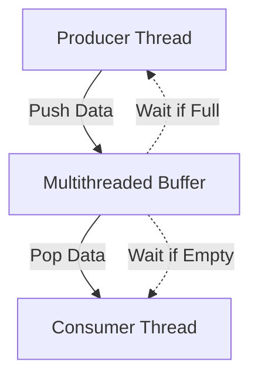

# multithreaded-buffer

## Introduction

The **multithreaded-buffer** project provides a robust buffering system designed for concurrent environments. This repository focuses on efficient thread-safe data buffering, making it ideal for scenarios requiring the seamless exchange of data between multiple threads. The buffer implementation ensures safe and predictable operations in multithreaded applications by addressing common concurrency challenges such as race conditions and synchronization.

## Usage

You can use the multithreaded-buffer in any application that requires exchanging data between producer and consumer threads. Simply include the provided buffer implementation files in your project, create an instance of the buffer, and use the exposed methods to add or retrieve data. The buffer manages synchronization internally, so you only need to interact with its interface.

### Basic Example

```cpp
#include "MultithreadedBuffer.h"

MultithreadedBuffer<int> buffer(10); // Create a buffer with capacity 10

// Producer thread
buffer.push(42);

// Consumer thread
int value = buffer.pop();
```

This example demonstrates how a producer can push data into the buffer, and a consumer can retrieve it, without worrying about thread safety.

## Configuration

The buffer can be configured at initialization to suit your application's needs:

- **Buffer Size:** Set the buffer's capacity when you create it.
- **Data Type:** Use template parameters to specify the type of data the buffer will hold.

### Example Configuration

```cpp
MultithreadedBuffer<std::string> stringBuffer(20); // Buffer for 20 strings
MultithreadedBuffer<double> doubleBuffer(5); // Buffer for 5 double values
```

Adjust the size and type according to your requirements.

## Features

- **Thread-Safe Operations:** All buffer methods are safe for use by multiple threads.
- **Blocking Semantics:** Producers wait if the buffer is full; consumers wait if the buffer is empty.
- **Flexible Data Types:** Implemented as a template, allowing storage of any copyable data type.
- **Configurable Capacity:** Set buffer size at construction time.
- **Efficient Synchronization:** Uses condition variables and mutexes for high performance.

## Requirements

To build and use this project, ensure your environment meets the following requirements:

- **C++11** or newer compiler (for threading and synchronization support)
- Compatible with major platforms (Linux, Windows, macOS)
- Standard C++ library

## Installation

Follow these steps to add **multithreaded-buffer** to your project:

1. **Clone the Repository:**

   ```bash
   git clone https://github.com/udayapeddirajub/multithreaded-buffer.git
   ```

2. **Add Source Files:**

   Copy the relevant header/source files (e.g., `MultithreadedBuffer.h`) into your project's source directory.

3. **Include in Your Project:**

   Include the buffer header in your code:

   ```cpp
   #include "MultithreadedBuffer.h"
   ```

4. **Compile Your Code:**

   Make sure your compiler flags enable C++11 or later.

   ```bash
   g++ -std=c++11 -pthread your_program.cpp -o your_program
   ```

5. **Run Your Application:**

   Execute your binary as usual. The buffer will handle thread safety automatically.

---

## Architecture Overview

Below is a high-level diagram of the core buffer workflow:



This diagram shows how producer and consumer threads interact safely with the buffer, waiting when appropriate.

---

## Key Considerations

- Always ensure the buffer is properly sized for your application's throughput.
- Use appropriate synchronization when starting or stopping threads that interact with the buffer.
- The buffer blocks threads when full or empty, ensuring no data is lost or duplicated.

---

For more details, please refer to the source code and comments within the repository.
